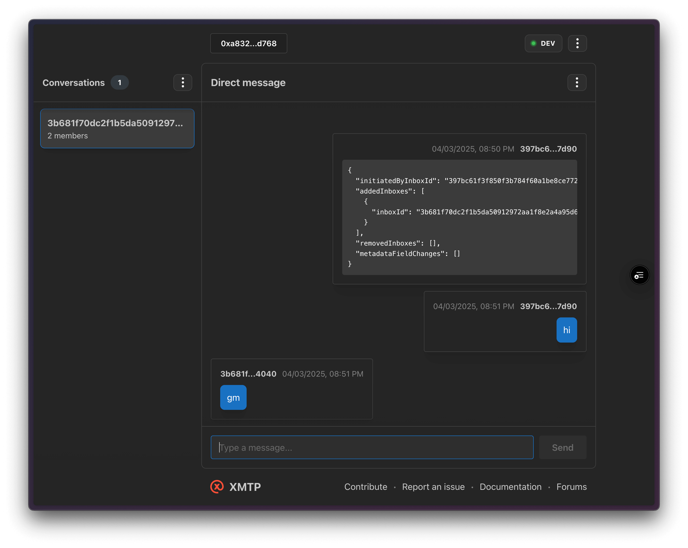

## GM bot

A simple XMTP agent that responds with `gm` to any message it receives.

> [!TIP]
> This example is part of the [XMTP agent examples](https://github.com/ephemeraHQ/xmtp-agent-examples) collection.

## Web inbox

Try XMTP using [xmtp.chat](https://xmtp.chat) and sending a message to `gm.xmtp.eth`



## Configuration

The bot supports the following environment variables for high-volume processing:

```bash
XMTP_ENV=dev                   # XMTP network (dev, production)
XMTP_WALLET_KEY=               # Private key for wallet creation
XMTP_DB_ENCRYPTION_KEY=        # Encryption key for database

```

## Run the agent

```bash
# git clone repo
git clone https://github.com/xmtp/gm-bot.git
# go to the folder
cd gm-bot
# install packages
yarn
# run the agent
yarn dev
```
